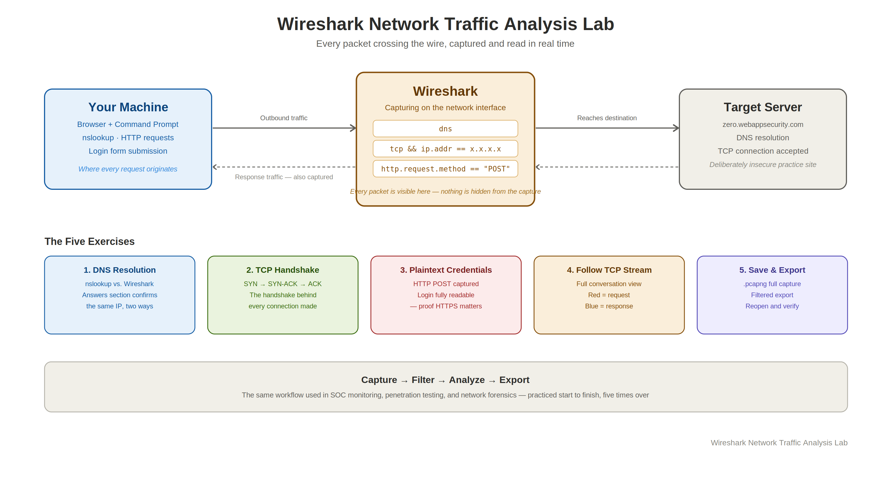

# Wireshark Network Traffic Analysis Lab

Five hands-on exercises capturing and analyzing live network traffic with Wireshark: watching DNS resolution happen packet by packet, catching a TCP handshake in the act, and proving firsthand why plaintext HTTP exposes login credentials to anyone watching the wire.


## 🎥 Watch Me Live
[Watch me capture and break down each exercise, live →](PASTE_YOUR_LINK_HERE)

## Overview

| Field | Value |
|---|---|
| Tools used | Wireshark, Windows Command Prompt |
| Time to complete | 1 to 2 hours |
| Difficulty | Beginner to Intermediate |
| Cost | $0 |
| Career relevance | SOC Analyst, Penetration Tester, Network Security Engineer, IT Support |

## The Problem This Lab Solves

Every action on a network, resolving a domain name, opening a connection, submitting a login form, produces traffic that can be captured and read. Most people use the internet every day without ever seeing that layer. A SOC analyst, penetration tester, or network engineer has to be comfortable in that layer, because that's where anomalies, misconfigurations, and active attacks actually show up.

This lab builds that comfort directly. Instead of reading about how DNS resolution or the TCP handshake works, each exercise captures the real packets live and walks through exactly what's inside them. The HTTP credential exercise in particular makes an abstract security principle, "HTTP is insecure", into something you've actually watched happen: a real login form, submitted over plaintext, with the username and password sitting completely readable in the capture.

## How This Lab Works



## What I Built

- Captured and correlated a live DNS query with `nslookup`, confirming Wireshark's captured response matches the command line output exactly
- Identified a full TCP three-way handshake (SYN, SYN-ACK, ACK) on a live connection by filtering on the destination IP
- Captured an HTTP login attempt on a deliberately insecure practice site and located the submitted credentials in plaintext inside the POST request
- Used Follow TCP Stream to reconstruct an entire browser-to-server conversation, request and response, in one readable view
- Practiced the full save/filter/export/reopen workflow for packet captures, the same process used to document findings or hand off evidence in real security work

## Skills Demonstrated

| Skill | Real-world application |
|---|---|
| Capturing live traffic on a network interface | The fundamental Wireshark skill everything else builds on |
| Reading and applying Wireshark display filters | `dns`, `tcp && ip.addr == x.x.x.x`, `http.request.method == "POST"`, the exact filtering skill used to isolate signal from noise in a real capture |
| Identifying the TCP three-way handshake | Fundamental to troubleshooting connectivity and spotting suspicious connection attempts during monitoring |
| Recognizing plaintext credential exposure over HTTP | The concrete, hands-on version of "always use HTTPS", useful for explaining protocol security to non-technical stakeholders too |
| Using Follow TCP Stream for session reconstruction | A real network forensics technique for understanding exactly what happened during a session |
| Saving, filtering, and exporting captures | The documentation and evidence-handling workflow used in incident response and SOC reporting |

## ⚠️ A Note on Scope

The credential-capture exercise is performed against `zero.webappsecurity.com`, a deliberately insecure practice site built for exactly this kind of testing. Capturing or intercepting credentials on any system or site you don't own or have explicit permission to test is illegal. This lab stays entirely within a sanctioned practice environment.

## Setup — Step by Step

### Prerequisites
- Wireshark installed ([download here](https://www.wireshark.org/download.html))
- Windows Command Prompt
- An active internet connection
- A browser for the HTTP exercises

### Exercise 1 — DNS Query Analysis with NSLookup

**Objective:** Capture a live DNS query with `nslookup` while Wireshark monitors in real time, and see a domain name resolve to an IP address at the packet level.

1. Open Wireshark and start a capture on your active network interface
2. Open Command Prompt side by side
3. Run:
   ```
   nslookup google.com
   ```
4. Return to Wireshark and **stop the capture**
5. In the filter bar, type `dns` and press Enter
6. Find the **Standard Query Response** packet for `google.com`
7. Click it and expand the **Answers** section in the packet details panel

**What to look for:** The DNS response returning one or more IP addresses for `google.com`, matching exactly what `nslookup` printed in the command line. This confirms both tools are observing the same resolution in real time.

> **Takeaway:** Every website visit starts with a DNS query resolving a domain name into an IP address. Wireshark shows that process at the packet level, and it lines up exactly with what `nslookup` reports.

### Exercise 2 — Spotting the TCP Three-Way Handshake

**Objective:** Capture a live TCP three-way handshake by visiting a website while monitoring traffic, and see how every connection is established before any data moves.

1. Start a Wireshark capture on your active interface
2. Open a new browser window and navigate to `http://zero.webappsecurity.com`
3. In Command Prompt, run:
   ```
   nslookup zero.webappsecurity.com
   ```
4. Note the IP address returned
5. Stop the Wireshark capture
6. Apply the filter, using that IP:
   ```
   tcp && ip.addr == x.x.x.x
   ```
7. Look for the three-packet handshake sequence: **SYN**, **SYN-ACK**, **ACK**

**What to look for:** Three packets in sequence, with the Flags column showing `[SYN]`, `[SYN, ACK]`, and `[ACK]`, all completing before any actual data transfer begins.

> **Takeaway:** Every website visit, download, and login begins with this handshake. Recognizing it is fundamental to troubleshooting connectivity and spotting suspicious connection attempts during security monitoring.

### Exercise 3 — Capturing Credentials over HTTP (Man-in-the-Middle Demo)

**Objective:** Demonstrate how unencrypted HTTP exposes login credentials in plaintext, and why that makes HTTP vulnerable to Man-in-the-Middle attacks.

> Performed only on `zero.webappsecurity.com`, a deliberately insecure practice environment. Never capture credentials on systems or sites you don't own.

1. Start a new Wireshark capture
2. Navigate to `http://zero.webappsecurity.com` and go to the login page
3. Enter test credentials and attempt to log in (the login is expected to fail)
4. Stop the capture
5. Apply the filter:
   ```
   http.request.method == "POST"
   ```
6. Locate the POST packet and expand **HTML Form URL Encoded** in the packet details

**What to look for:** The submitted login credentials, fully readable in plaintext, with zero encryption protecting them. This is exactly what an attacker on the same network segment would see in a real Man-in-the-Middle scenario.

> **Takeaway:** This is why HTTPS is not optional. HTTP transmits everything, including credentials, in plaintext. HTTPS encrypts that same data via TLS, making it unreadable to anyone intercepting the traffic. Always check for the padlock before entering sensitive information anywhere.

### Exercise 4 — TCP Stream Analysis (Following the Full Conversation)

**Objective:** Use Wireshark's Follow TCP Stream feature to reconstruct the full conversation between a browser and a web server.

1. Start a capture on your active interface
2. Navigate to `http://zero.webappsecurity.com` and browse briefly
3. Stop the capture
4. Filter on `http`
5. Right-click any HTTP packet in the results
6. Select **Follow → TCP Stream**

**What to look for:** Red text for data sent from the browser (the request), blue text for data sent back from the server (the response), with headers, page content, and session details all fully visible.

> **Takeaway:** Follow TCP Stream reconstructs the entire client-server conversation. For HTTP traffic this is completely readable, a genuinely powerful technique in network forensics, troubleshooting, and security analysis.

### Exercise 5 — Saving and Exporting Captures

**Objective:** Save full captures and export filtered subsets, essential for documentation, incident response, and sharing findings with a team.

**Part A — Save the full capture**
1. **File → Save As**
2. Name it, e.g. `capture101`
3. Save as `.pcapng`, Wireshark's standard format, capturing every packet from the session

**Part B — Export specific packets**
1. Apply a filter to narrow to the relevant packets, e.g. `http`
2. **File → Export Specified Packets**
3. Name it, e.g. `special_packets`
4. Choose **Displayed** to export only the filtered packets shown
5. Save

**Part C — Reopen a saved capture**
1. **File → Open**
2. Browse to the saved `.pcapng` file
3. All previously captured packets load back exactly as they were

> **Takeaway:** Saving and exporting captures properly is essential in real security work, whether documenting a lab, preserving evidence, or handing findings off to a colleague.

## Summary

| Exercise | Protocol | Key Concept |
|---|---|---|
| 1 | DNS | Domain resolution, confirmed against NSLookup output |
| 2 | TCP | Three-way handshake: SYN, SYN-ACK, ACK |
| 3 | HTTP POST | Plaintext credential exposure, MitM demonstration |
| 4 | HTTP / TCP | Follow TCP Stream, full browser-to-server conversation |
| 5 | N/A | Saving, filtering, exporting, and reopening captures |

## Screenshots

*(Images go in a `/screenshots` folder in this repo, see the note below for how to wire them up.)*

Planned screenshots, one per exercise:

1. **DNS response in Wireshark next to the matching `nslookup` output** — proves both tools show the same resolution
2. **The TCP handshake packets** — SYN, SYN-ACK, ACK visible in sequence with the Flags column highlighted
3. **The plaintext credentials inside the POST request** — the core proof behind the HTTPS argument
4. **A Follow TCP Stream window** — showing the red/blue request-response reconstruction
5. **The Export Specified Packets dialog** — showing a filtered capture being saved

Each will get a short takeaway written underneath once captured.

## Real-World Relevance

These exercises map directly to skills used in:

- **SOC Analysis** — monitoring network traffic for anomalies
- **Penetration Testing** — identifying insecure protocols in active use
- **Cloud Security** — the same filtering instincts apply directly to reading VPC flow logs and cloud network monitoring
- **IT Support / Troubleshooting** — diagnosing connectivity and DNS issues at the packet level instead of guessing

## Related Labs

- **Lab 1** — NTFS File Server
- **Lab 2** — Azure RBAC Access Control
- **Lab 3** — Splunk SIEM & Log Analysis
- **Lab 4** — ServiceNow ITSM
- **Lab 5** — Nessus Vulnerability Scanning
